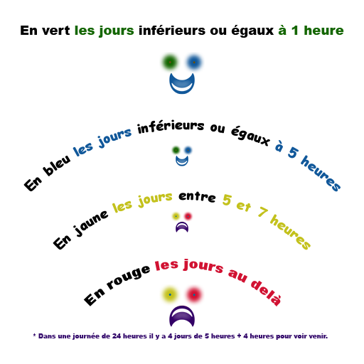

# MoonManager

 

**Easy project management software for human workloads best fits**


Timely funded and founded by Monwoo 2018.
Financé temporellement et fondé par Monwoo 2018.

Démo : https://monwoo.com/MoonManager/Demo/

#### FR

Nos ancêtres ont fait au mieux en France pour nous apporter les 35 heures avec congés payés.

Ils ont inventés le 'travail', qui n'est qu'une forme plus intensive de l'esclavage naturel de notre relation au monde.

Ainsi, ils ont pu générer un nouveau concepte dans leur époque : le sentiment de liberté.

L'esclavage moderne ayant raison de certaine de nos raisons, il ne nous est plus suffisant de croire en des droits vieux de plus de deux siècles déjà.

Droguée au nombre de taches accomplies ou via diverses méthodes addictives, notre temps s'amenuise à notre insu.

MoonManager est là pour vous permettre de présenter la valeur de votre temps.

A vous ensuite de le négocier au mieux.

Exemple de base de calcule pour interpréter des tarifs Freelances (Facturation de business à business, pouvant inclure des frais):

- 35hr par semaines avec 2.5 jours de congé payés par mois + arrêts maladies (prkoi fo absolument être malade pour une pause ??)
- = 7hr par jours avec 2.5 jours de congé payés par mois + arrêts maladies (prkoi fo absolument être malade pour une pause ??)
- = 7hr par jours avec environ une heures de congé payés par jour + arrêts maladies (prkoi fo absolument être malade pour une pause ??)
- = 5hr par jours de travails pour un contrat Business to Business Français.

Le problème, c'est que certains métiers nécessite des durées de productions plus importantes.

L'idée est donc de produire en équipe, et là, on as tous envi de jouer comme on peut...

MoonManager essayera de limiter la durée de l'esclavage moderne via 4 codes couleurs dans le thème de base :



Humainement parlant, l'objectif c'est de faire moins de 1hr par jours pour la réussite d'un objectif de charge vendu 1 journée au TJM du marché avec un résultat satisfaisant.

La notion de résultat ne devrais donc pas être une raison pour vous faire travailler plus, mais au contraire, vous faire travailler moins... Si ce n'est pas le cas, il est urgent de vous faire payer plus...

Cependant, la modernité n'étant pas le seul maître de notre vie, nous pouvons aller jusqu'à 5 heure de travail par jour pour le respect des 35hr. Au delà, il faudra rajouter des RTT, congée maladies, avantages de travails, heures sup, etc...

De plus, avec l'expèrience ou l'exigence, votre liberté se développe.

L'idéal serait de ne plus avoir obligation de travail pour tous.
En 2018, se libérer de l'esclavage naturel de son contexte immédiat n'est pas encore accessible à tous...

#### EN

In France, work is at most 35hr/week

The fight is not done. MoonManager will help you follow your workloads in any projects linkable to git logs and/or screen captures.

For now, let's narrow workload up to 1hr/day for best case, 5hr/day for regular, more than that is too much and needs appropriates compensations

# → Quick Documentation

## Viable targets :

This project use some advanced API to work fully.
We're using it under last Chrome webbrowser for now.
It may work under others, but we did not get time to try to ensure all polyfill for browsers that may support it.

## Install project :

```bash
# installing dependencies from package.json :
yarn install
# start dev server :
yarn start
# Extract strings from code and templates to src/app/translations/template.json :
yarn run translations:extract
# Display project documentation :
yarn run docs
# Running tests via Karma in watch mode for it to launch on each change you do to the code
# Nice to be run with dev server if you wanna do some tests driven developpments in real time :
yarn test

# To generate a new component|directive|pipe|service|class|module => replace 'component' below :
yarn run generate -- component <name>
yarn run generate -- module MoonManager
yarn run generate module moon-manager/MoonManagerRouting --flat --module=moon-manager
yarn run generate component moon-manager/MoonManager --flat --module=moon-manager
yarn run generate service moon-manager/services/RoutingSentinel --flat --module=moon-manager
yarn run generate component moon-manager/components/Header --module=moon-manager
yarn run generate component moon-manager/components/Body --module=moon-manager
yarn run generate component moon-manager/components/Footer --module=moon-manager
yarn run generate pipe moon-manager/pipes/Default --module=moon-manager
yarn run generate directive moon-manager/directives/NgLet --module=moon-manager
yarn run generate class moon-manager/components/client-files-loader/ConfigFormModel --module=moon-manager
# then rename config-form-model.ts to config-form.model.ts

# running tests for continous integration (will test all only once) :
yarn run test:ci

# export dev project as Zip file :
git archive --format=zip -o ~/goinfre/MonwooMoonManager.zip HEAD

# Ajusts manifest to setup Prod base url (TODO : from env file ? + same for proxy...)
# https://developers.google.com/web/fundamentals/web-app-manifest/
emacs src/manifest.json
# build productions file in dist folder with correct base-href for deploy :
yarn run build --base-href '/MoonManager/Demo/'
# zip result for Production Software delivery :
zip -r "MoonManager-Prod.zip" dist
```

## Extract your data for V1 imports :

```bash
# extract you git data for times report upload :
git log --all --date=iso --pretty=format:'"%h","%an","%ad","%s"' > git_logs.csv
<<COMMENT
To overwrite defaults computing on base scheme,
you can extend previouly generated model of those 5 optionnals columns :
"<author>","<project>","<subproject>","<objectif>","<skillId>"
COMMENT


# extract you captures data for times report upload :
<<COMMENT
No Need to extract captures via command lines.
For version 1, MoonManager will load your picture folder under last Google Chrome Webbrowser.
=> you can use command lines to do so, but simple Operting System finder tool
may be easyer to quickly look at the capture and move it to the right location...

You just need to ensure directory architecture following this pattern :
<author>/<project>/<subproject>/<objectif>/<skillId>/<captureRegex>

All thoses are optionnal, and will default to empty strings if not provided,
except for <skillId> that will default to : 'RemoteEasyDev'
and for <author> that will default to : localStorage param config or default 'John Doe'

Build for service@monwoo.com,
HT basis, is currently available at same rate than TTC basis.
Indeed, due to financials issues and art. 22 of financial French law for 2018,
basic theme available skills could be described as :
- RemoteEasyDev (TJM 400€/5hr) : Service de développement sur demande pour des objectifs :
  - faciles et executable en 1 journée au maximum.
  - sans nécessité de suivi ni gestion de projet.
- RemoteProjectManagement (TJM 500€/5hr) : Service de gestion de projet.
- RemoteReverseEngineering (TJM 600€/5hr) : Service d'analyse logiciel.
- RemoteFeaturesForcast (TJM 700€/5hr) : Service de veille technique et prévisionnelle
- RemoteFullTutorialAndKnowledgeTransfert (TJM 800€/5hr) :
  - Service d'analyse de connaissances
  - Service transfert de connaissances
  - Service de formation

Pour faire simple facilement :
- apprenez à vous connaitre pour faciliter vos objectifs
- appréhendez et accompagnez le context pour atteindre au mieux un résultat simple

COMMENT

```

## For advanced documentation :

You're the documentation. To learn it, you can start by learning all usages of https://github.com/ngx-rocket/starter-kit, and then, code will be self explanatory.

MoonManager is simply some configuration and some more stuffs added to it.

# → Livre d'or des métiers

**Ci-dessous l'annuaire des métiers ayant des compétances d'usages du MoonManager :**

---

**Monwoo Theater Viewer (service@monwoo.com) :** produit Monwoo utilisé pour suivre le temps de M. Miguel Monwoo.

---

> Ps : n'hésitez pas à rajoutez votre carte business ci-dessus si vous avez un usage métier du MoonManager.

# → Bibliographie et veilles :

[Développment stuffs (click me)](docs/bibliographie.md)

---

Design stuffs :

- http://www.favicomatic.com/
- https://www.wikihow.com/Woo-a-Girl
- https://www.angularjswiki.com/angular/angular-material-icons-list-mat-icon-list/
- https://fontawesome.com/icons?d=gallery&m=free
- https://tacticalinvestor.com/ultimate-futures-timing-indicator/
- https://www.google.fr/search?q=timing+indicator&source=lnms&tbm=isch&sa=X
- https://mycolor.space/gradient
- http://www.colorzilla.com/gradient-editor/
- https://cssgradient.io/
- http://angrytools.com/gradient/

bon, voilà, en mode bitMap là, à placer des points sur la carte. Va falloir passer en mode SVG (So Vastly Good) [by Miguel]

- https://www.webcreatorbox.com/en/tutorials/sass-mixin-en
- https://medium.com/@MateMarschalko/dynamic-colour-palettes-with-sass-and-hsl-805b8bbef758
- https://internet-inspired.com/wrote/colour-magic-with-sass/
- https://gist.github.com/jareware/4738651

- https://www.sessions.edu/color-calculator/

---

Pushing to this repo :

- https://help.github.com/articles/duplicating-a-repository/
- https://help.github.com/articles/fork-a-repo/
- https://gist.github.com/jacquesd/85097472043b697ab57ba1b1c7530274
- https://help.github.com/articles/creating-a-pull-request-from-a-fork/
- https://help.github.com/articles/about-forks/
- https://www.gun.io/blog/how-to-github-fork-branch-and-pull-request

**Wysiwyg Fork with www.github.com :**
Forking a repository is a simple two-step process. We've created a repository for you to practice with!
On GitHub, navigate to the Monwoo/MoonManager repository.
Look for the Fork button In the top-right corner of the page, click Fork.
That's it! Now, you have a fork of the original Monwoo/MoonManager repository.

**Manual Fork with your command line :**

```bash
# clone original repo with bare option :
git clone --bare https://github.com/Monwoo/MoonManager.git
# create you own repo with your custom git tool, then minor push the original one :
cd MoonManager
git remote add --track master upstream <your custom repo push url>
# cleaning original repo :
cd .. && rm -rf MoonManager
git clone <your custom repo push url>
cd <your clonned folder>
# If you want, add the original repo as remote to fetch (potential) future changes.
# Make sure you also disable push on the remote (as you are not allowed to push to it anyway).
git remote add upstream <your custom repo push url>
git remote set-url --push upstream DISABLE
# When you push, do so on origin with :
git push origin
# When you want to pull changes from upstream you can just fetch the remote
# and rebase on top of your work + fix conflicts if any :
git fetch upstream
git rebase upstream/master
```

**Now you're getting ready to start :**
You'll want to switch off of the 'master' branch and onto a different branch for your new feature. It's important to do this because you can only have one Pull Request per branch, so if you want to submit more than one fix, you'll need to have multiple branches. Make a new branch like this:

```bash
git branch newfeature
```

Then switch to it like this:

```bash
git checkout newfeature
```

Now you're on your new branch. You can confirm this by simply typing :

```bash
git branch
# check local branches AND remotes branches :
git branch -a
```

---

# → Credits

Please, if you push to my repo, add your crédits below with a short description :

---

**2018/11/21 :** D'après une idée de M. Miguel Monwoo.

---

**2018/11/22 :** MoonManager commence avec pour base : https://github.com/ngx-rocket/starter-kit

---

**2018/11/22 :** Start point Tutorial for Advanced Dev usage : https://github.com/ngx-rocket/starter-kit

---

**2018/11/23 :** Création du logo du MoonManager par M. Miguel Monwoo, © Monwoo 2018

---

**2018/11/24 :** Création du Module MoonManager pour centraliser la base du reporting.

---

**2018/11/24 :** Ajout des outils nécessaires pour du web reporting via MoonManager.

---

**2018/11/24 :** Génération des logos et autre formats Web/Mobile avec http://www.favicomatic.com/

---

**2018/11/24 :** Ajustements du Module MoonManager

---

**2018/11/25 :** Adding client's side file loader

---

**2018/11/25 :** 'How to pull request' Knowledge transfert

---

**2018/11/25 :** Adding parameters view + ajusting router for fluent header/body/footer factorized app.

---

**2018/11/26 :** Linking parameters and components configs via LocalStorage + add Notification system

---

**2018/11/26 :** Improving Media storage

---

**2018/11/26 :** Adding Monwoo timings pivot and dependencies

---

**2018/11/27 :** Création du visuel TimingsIndicatorStory.png par M. Miguel Monwoo, © Monwoo 2018

---

**2018/11/27 : (prévisionnel)** Load git logs, Improve design, usability and parameters for timing components

---

**2018/11/27 : (prévisionnel)** Import/export of timings dataset (csv)

---

**2018/11/27 : (prévisionnel)** Import/export of medias dataset (json)

---

### Liked it? Give it a star 🌟, Moon will love it :). If not, please help us woo it.
